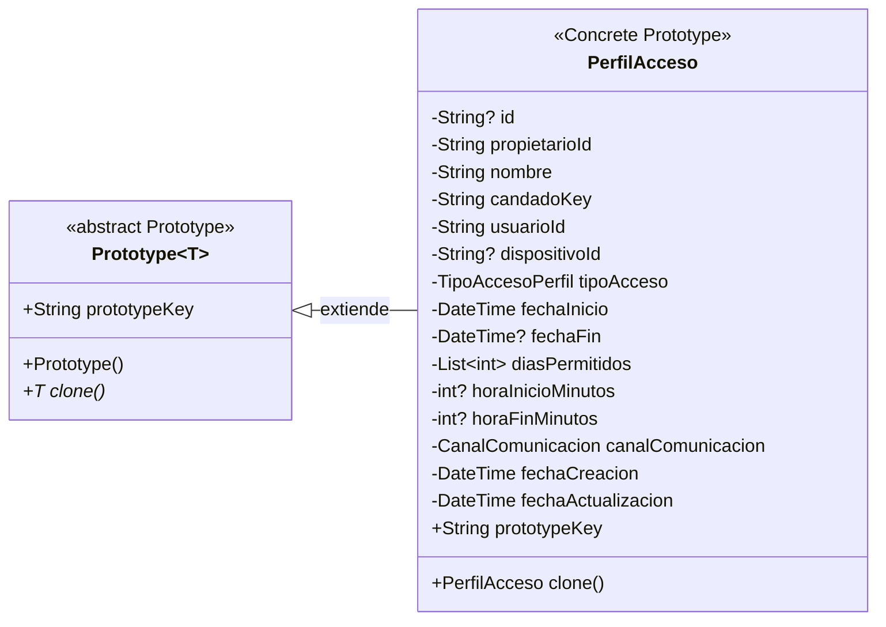

# Prototype — `PerfilAcceso`

**Archivos fuente:** `lib/patterns/access/prototype.dart` y `lib/models/perfil_acceso_model.dart`.

## Clases estrictamente pertenecientes al patrón

## Funcionamiento en el proyecto

`Prototype<T>` define el contrato mínimo del patrón: una clave de prototipo y la operación `clone()`. `PerfilAcceso` es la única clase concreta que implementa este patrón en el proyecto; extiende `Prototype<PerfilAcceso>` y devuelve otra instancia del mismo tipo.

`PerfilAcceso.clone()` conserva la configuración del perfil —usuario, candado, tipo de acceso, fechas, días, horario y canal— pero crea un nuevo objeto con `id: null`, nuevas fechas de creación y actualización y una nueva lista inmodificable de días. De esta forma, la copia puede guardarse como un perfil diferente sin modificar el original.

El servicio `PerfilesAccesoService` utiliza `PrototypeStore` para localizar el prototipo y llamar a `clone()`. `PrototypeStore` no aparece en este diagrama porque es un registro auxiliar de prototipos, no un rol estructural del patrón Prototype. Del mismo modo, `copyWith()` y `prototypeKey` son miembros de `PerfilAcceso`, pero no clases adicionales del patrón.

La estructura cumple Prototype porque el objeto concreto se duplica mediante una operación polimórfica definida en la abstracción, evitando reconstruir manualmente todos sus atributos.
