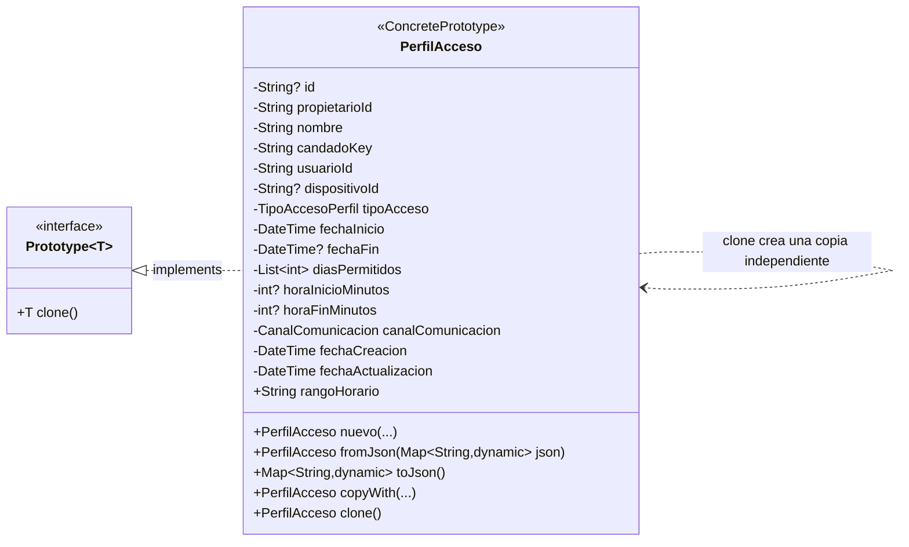

# Prototype — `PerfilAcceso`

**Archivo fuente:** `lib/patterns/access/prototype.dart` y `lib/models/perfil_acceso_model.dart`.

## Diagrama de clases

## Funcionamiento en el proyecto

`Prototype<T>` define la operación `clone()`. `PerfilAcceso` es el `ConcretePrototype`: contiene toda la configuración reutilizable de un acceso, como usuario, candado, tipo de acceso, vigencia, días, horario y canal de comunicación.

Cuando el usuario duplica un perfil desde la funcionalidad de perfiles de acceso, se invoca `perfil.clone()`. La copia conserva la configuración funcional, pero recibe `id: null` y nuevas fechas de creación y actualización. Además, `diasPermitidos` se reconstruye como una lista inmodificable, por lo que el original y la copia no comparten la misma referencia mutable.

La aplicación usa correctamente Prototype porque la operación no crea una configuración desde cero ni obliga a conocer todos sus campos. Parte de un perfil ya configurado y produce otra instancia equivalente que puede persistirse como un nuevo perfil sin alterar el original. `PerfilAcceso.nuevo`, `fromJson` y `copyWith` no son roles adicionales del patrón; se muestran únicamente porque son métodos propios de la clase concreta que participa directamente en la clonación.
