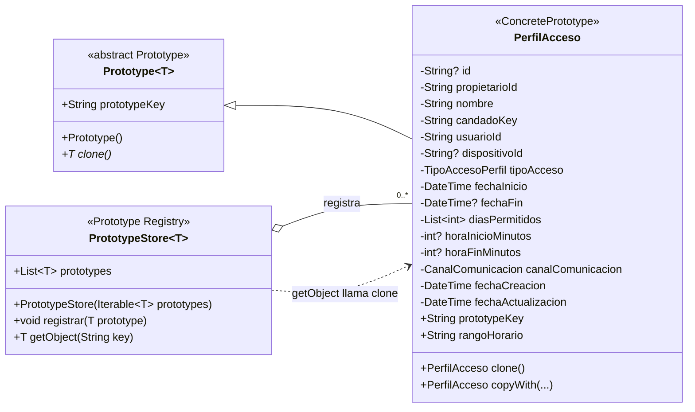

# Prototype — `PerfilAcceso` y `PrototypeStore`

**Archivos fuente:** `lib/patterns/access/prototype.dart`, `lib/models/perfil_acceso_model.dart` y `lib/services/candado/perfiles_acceso_service.dart`.

## Diagrama de clases

## Funcionamiento en el proyecto

`Prototype<T>` ahora es una clase abstracta con tres elementos del contrato: su constructor `const`, `prototypeKey` para identificar el prototipo y `clone()` para producir una copia. `PerfilAcceso` es el `ConcretePrototype` porque extiende `Prototype<PerfilAcceso>`, define su clave y conserva la implementación de clonación.

`PrototypeStore<T>` actúa como registro de prototipos. `registrar()` reemplaza un prototipo existente con la misma clave y `getObject(key)` busca el prototipo registrado y devuelve `prototype.clone()`, en vez de devolver la misma instancia. En `PerfilesAccesoService.duplicarPerfil()` se registra el perfil original, se obtiene una copia mediante `getObject(perfil.prototypeKey)`, se cambia su nombre y se persiste como un nuevo perfil.

La implementación aplica correctamente Prototype porque el flujo de duplicación parte de una configuración existente y evita reconstruir manualmente todos sus campos. `PerfilAcceso.clone()` conserva la configuración funcional, genera `id: null`, actualiza las fechas y crea una nueva lista inmodificable de días. La clave calculada por `id ?? '$propietarioId:$candadoKey:$nombre'` permite registrar también perfiles nuevos que todavía no tienen identificador de base de datos.

`PrototypeStore` sí se usa en el servicio real y no es una clase aislada. No es Singleton: cada operación puede crear un registro independiente con los prototipos que necesite.
