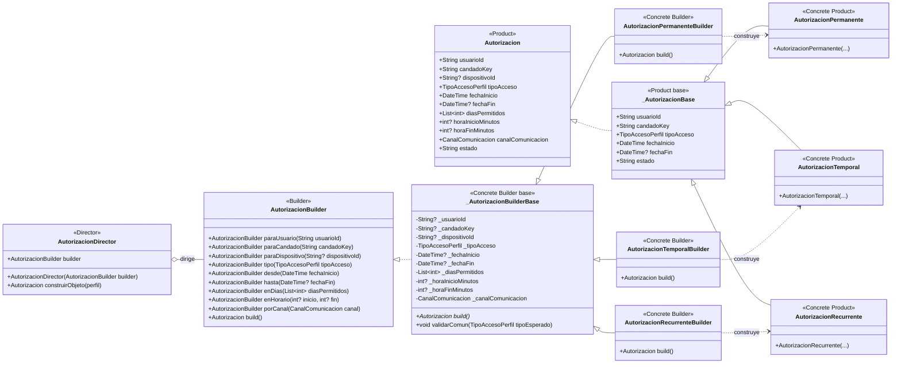

# Builder — `AutorizacionBuilder`

**Archivos fuente:** `lib/patterns/access/autorizacion_builder.dart` y `lib/patterns/access/autorizacion.dart`.

## Clases estrictamente pertenecientes al patrón

## Funcionamiento en el proyecto

`AutorizacionBuilder` es el `Builder` abstracto. `_AutorizacionBuilderBase` contiene el estado común y la validación compartida; las clases `AutorizacionPermanenteBuilder`, `AutorizacionTemporalBuilder` y `AutorizacionRecurrenteBuilder` son los `Concrete Builder` y producen respectivamente un producto especializado.

`AutorizacionDirector` recibe un builder, establece en orden los datos del perfil y llama a `build()`. El resultado se expone como `Autorizacion`, mientras que las clases concretas `AutorizacionPermanente`, `AutorizacionTemporal` y `AutorizacionRecurrente` representan los productos reales.

El patrón está correctamente aplicado porque separa la construcción paso a paso de la representación final y permite aplicar reglas distintas: el builder temporal exige fecha final y el recurrente exige días y horario. `PerfilAcceso` solo es el objeto de entrada que el director lee; no es un participante estructural del patrón y por eso no se incluye como clase.

Se conservan `_AutorizacionBuilderBase` y `_AutorizacionBase` porque son superclases reales de las clases conformantes: contienen el estado y comportamiento que las implementaciones concretas heredan directamente.
