# Builder — `AutorizacionBuilder`

**Archivos fuente:** `lib/patterns/access/autorizacion_builder.dart` y `lib/patterns/access/autorizacion.dart`.

## Diagrama de clases

```mermaid
classDiagram
    direction LR

    class AutorizacionBuilder {
        <<Builder interface>>
        +AutorizacionBuilder paraUsuario(String usuarioId)
        +AutorizacionBuilder paraCandado(String candadoKey)
        +AutorizacionBuilder paraDispositivo(String? dispositivoId)
        +AutorizacionBuilder tipo(TipoAccesoPerfil tipoAcceso)
        +AutorizacionBuilder desde(DateTime fechaInicio)
        +AutorizacionBuilder hasta(DateTime? fechaFin)
        +AutorizacionBuilder enDias(List~int~ diasPermitidos)
        +AutorizacionBuilder enHorario(int? inicio, int? fin)
        +AutorizacionBuilder porCanal(CanalComunicacion canal)
        +Autorizacion build()
    }

    class _AutorizacionBuilderBase {
        <<abstract Concrete Builder base>>
        -String? _usuarioId
        -String? _candadoKey
        -String? _dispositivoId
        -TipoAccesoPerfil _tipoAcceso
        -DateTime? _fechaInicio
        -DateTime? _fechaFin
        -List~int~ _diasPermitidos
        -int? _horaInicioMinutos
        -int? _horaFinMinutos
        -CanalComunicacion _canalComunicacion
        +AutorizacionBuilder paraUsuario(String usuarioId)
        +AutorizacionBuilder paraCandado(String candadoKey)
        +AutorizacionBuilder paraDispositivo(String? dispositivoId)
        +AutorizacionBuilder tipo(TipoAccesoPerfil tipoAcceso)
        +AutorizacionBuilder desde(DateTime fechaInicio)
        +AutorizacionBuilder hasta(DateTime? fechaFin)
        +AutorizacionBuilder enDias(List~int~ diasPermitidos)
        +AutorizacionBuilder enHorario(int? inicio, int? fin)
        +AutorizacionBuilder porCanal(CanalComunicacion canal)
        +Autorizacion build()*
        +void validarComun(TipoAccesoPerfil tipoEsperado)
    }

    class AutorizacionPermanenteBuilder {
        <<Concrete Builder>>
        +Autorizacion build()
    }

    class AutorizacionTemporalBuilder {
        <<Concrete Builder>>
        +Autorizacion build()
    }

    class AutorizacionRecurrenteBuilder {
        <<Concrete Builder>>
        +Autorizacion build()
    }

    class AutorizacionDirector {
        <<Director>>
        +AutorizacionBuilder builder
        +AutorizacionDirector(AutorizacionBuilder builder)
        +Autorizacion construirObjeto(PerfilAcceso perfil)
    }

    class Autorizacion {
        <<Product interface>>
        +String usuarioId
        +String candadoKey
        +String? dispositivoId
        +TipoAccesoPerfil tipoAcceso
        +DateTime fechaInicio
        +DateTime? fechaFin
        +List~int~ diasPermitidos
        +int? horaInicioMinutos
        +int? horaFinMinutos
        +CanalComunicacion canalComunicacion
        +String estado
    }

    class _AutorizacionBase {
        <<abstract Product base>>
        +String usuarioId
        +String candadoKey
        +TipoAccesoPerfil tipoAcceso
        +DateTime fechaInicio
        +DateTime? fechaFin
        +String estado
    }

    class AutorizacionPermanente {
        <<Concrete Product>>
        +AutorizacionPermanente(...)
    }

    class AutorizacionTemporal {
        <<Concrete Product>>
        +AutorizacionTemporal(...)
    }

    class AutorizacionRecurrente {
        <<Concrete Product>>
        +AutorizacionRecurrente(...)
    }

    class PerfilAcceso {
        <<Input collaborator>>
        +String usuarioId
        +String candadoKey
        +TipoAccesoPerfil tipoAcceso
        +DateTime fechaInicio
        +DateTime? fechaFin
        +List~int~ diasPermitidos
        +int? horaInicioMinutos
        +int? horaFinMinutos
        +CanalComunicacion canalComunicacion
    }

    AutorizacionBuilder <|.. _AutorizacionBuilderBase
    _AutorizacionBuilderBase <|-- AutorizacionPermanenteBuilder
    _AutorizacionBuilderBase <|-- AutorizacionTemporalBuilder
    _AutorizacionBuilderBase <|-- AutorizacionRecurrenteBuilder
    Autorizacion <|.. _AutorizacionBase
    _AutorizacionBase <|-- AutorizacionPermanente
    _AutorizacionBase <|-- AutorizacionTemporal
    _AutorizacionBase <|-- AutorizacionRecurrente
    AutorizacionDirector o-- AutorizacionBuilder : usa
    AutorizacionDirector ..> PerfilAcceso : lee configuración
    AutorizacionDirector ..> Autorizacion : devuelve
    AutorizacionPermanenteBuilder ..> AutorizacionPermanente : construye
    AutorizacionTemporalBuilder ..> AutorizacionTemporal : construye
    AutorizacionRecurrenteBuilder ..> AutorizacionRecurrente : construye
```

## Funcionamiento en el proyecto

`AutorizacionBuilder` define el contrato de construcción paso a paso. `_AutorizacionBuilderBase` concentra el estado común, los métodos fluentes y la validación compartida. Los tres builders concretos implementan `build()` y determinan qué producto concreto crear: `AutorizacionPermanente`, `AutorizacionTemporal` o `AutorizacionRecurrente`.

`AutorizacionDirector` recibe un builder por inyección, copia al builder los datos de un `PerfilAcceso` y finalmente llama `build()`. Así, el director conoce el orden de construcción, pero no necesita conocer la clase concreta del producto. Las reglas específicas se validan mediante `validarComun(tipoEsperado)`: un builder no puede construir un tipo distinto al que le corresponde; los accesos temporales requieren fecha final y los recurrentes requieren días y horario.

La aplicación usa correctamente Builder porque la autorización tiene muchos parámetros opcionales y reglas condicionales. El cliente puede elegir el builder concreto y delegar la secuencia al director, mientras que el producto final se expone mediante la interfaz `Autorizacion`. La separación entre interfaz, base reutilizable, builders concretos, director y productos concretos hace explícito el patrón y evita el constructor monolítico anterior.
