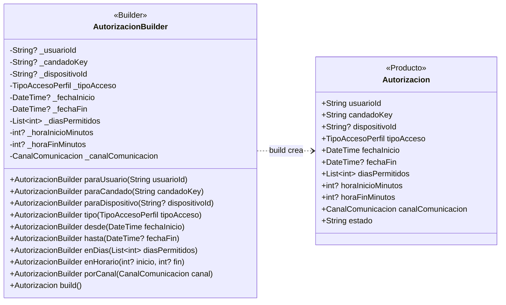

# Builder — `AutorizacionBuilder`

**Archivo fuente:** `lib/patterns/access/autorizacion_builder.dart` y `lib/patterns/access/autorizacion.dart`.

## Diagrama de clases

## Funcionamiento en el proyecto

`AutorizacionBuilder` concentra la construcción paso a paso de una `Autorizacion`. En lugar de exponer un constructor con muchos argumentos posicionales, permite configurar cada parte con métodos expresivos: usuario, candado, dispositivo, tipo, fechas, días, horario y canal.

Cada método de configuración retorna `this`, por lo que se puede encadenar la construcción. `build()` valida las reglas del dominio antes de crear el producto: usuario y candado obligatorios, fecha inicial, fecha final para accesos temporales, días y horario para accesos recurrentes, rangos horarios válidos y días entre 1 y 7. Si alguna regla falla, lanza `ArgumentError`; si todo es válido, crea una `Autorizacion` inmutable.

La aplicación usa correctamente Builder porque una autorización tiene múltiples opciones y reglas condicionales según su tipo. El patrón separa la configuración progresiva y la validación de la representación final. `Autorizacion` es el único producto del diagrama; enums como `TipoAccesoPerfil` y `CanalComunicacion` son tipos de dominio usados por sus atributos, no clases participantes adicionales del patrón.
