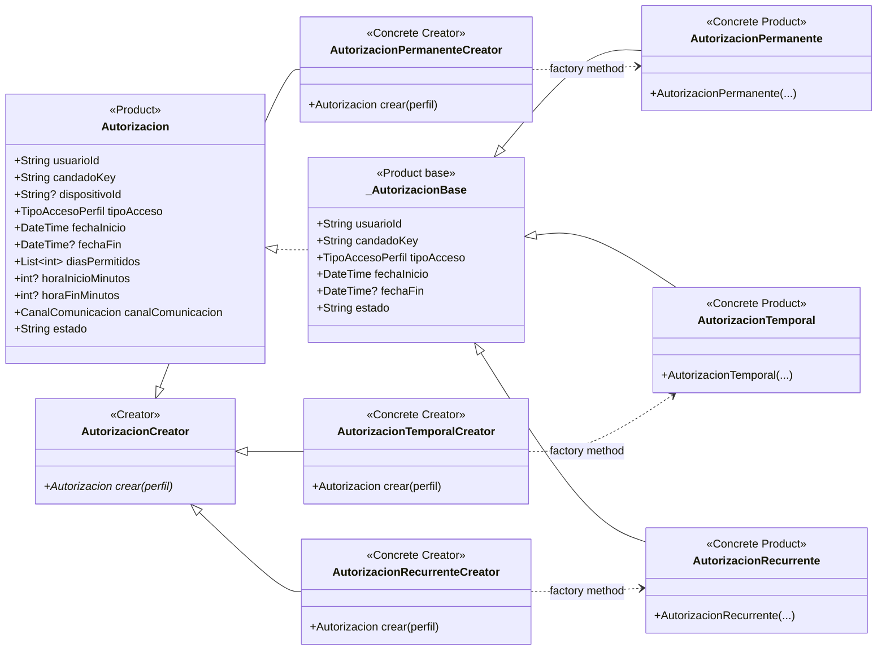

# Factory Method — `AutorizacionCreator`

**Archivos fuente:** `lib/patterns/access/autorizacion_creator.dart` y `lib/patterns/access/autorizacion.dart`.

## Clases estrictamente pertenecientes al patrón

## Funcionamiento en el proyecto

`AutorizacionCreator` es el `Creator` y declara el método fábrica `crear(PerfilAcceso perfil)`. Sus tres subclases son los `Concrete Creator`: cada una decide qué producto concreto devuelve.

`AutorizacionPermanenteCreator` crea `AutorizacionPermanente`, `AutorizacionTemporalCreator` crea `AutorizacionTemporal` y `AutorizacionRecurrenteCreator` crea `AutorizacionRecurrente`. Todos los productos se entregan mediante la abstracción `Autorizacion`, que permite que el servicio cliente trabaje con un tipo común.

`PerfilesAccesoService.construirAutorizacion()` selecciona el creador según el tipo de acceso y llama polimórficamente a `crear()`. El hecho de que cada creator use internamente `AutorizacionDirector` y un builder concreto pertenece al patrón Builder y no a la estructura de Factory Method; por eso esas clases no aparecen aquí.

`PerfilAcceso` es el parámetro de entrada del método fábrica, pero no es Creator ni Product. `_AutorizacionBase` se conserva porque es la superclase concreta compartida por los tres productos y forma parte de su jerarquía real de producto.
