# Factory Method — `AutorizacionCreator`

**Archivos fuente:** `lib/patterns/access/autorizacion_creator.dart`, `lib/patterns/access/autorizacion_builder.dart` y `lib/patterns/access/autorizacion.dart`.

## Diagrama de clases

```mermaid
classDiagram
    direction LR

    class AutorizacionCreator {
        <<Creator>>
        +Autorizacion crear(PerfilAcceso perfil)*
    }

    class AutorizacionPermanenteCreator {
        <<Concrete Creator>>
        +Autorizacion crear(PerfilAcceso perfil)
    }

    class AutorizacionTemporalCreator {
        <<Concrete Creator>>
        +Autorizacion crear(PerfilAcceso perfil)
    }

    class AutorizacionRecurrenteCreator {
        <<Concrete Creator>>
        +Autorizacion crear(PerfilAcceso perfil)
    }

    class Autorizacion {
        <<Product interface>>
        +String usuarioId
        +String candadoKey
        +String? dispositivoId
        +TipoAccesoPerfil tipoAcceso
        +DateTime fechaInicio
        +DateTime? fechaFin
        +List~int~ diasPermitidos
        +int? horaInicioMinutos
        +int? horaFinMinutos
        +CanalComunicacion canalComunicacion
        +String estado
    }

    class _AutorizacionBase {
        <<abstract Product base>>
        +String usuarioId
        +String candadoKey
        +TipoAccesoPerfil tipoAcceso
        +DateTime fechaInicio
        +DateTime? fechaFin
        +String estado
    }

    class AutorizacionPermanente {
        <<Concrete Product>>
        +AutorizacionPermanente(...)
    }

    class AutorizacionTemporal {
        <<Concrete Product>>
        +AutorizacionTemporal(...)
    }

    class AutorizacionRecurrente {
        <<Concrete Product>>
        +AutorizacionRecurrente(...)
    }

    class AutorizacionBuilder {
        <<Builder collaborator>>
        +AutorizacionBuilder paraUsuario(String usuarioId)
        +AutorizacionBuilder paraCandado(String candadoKey)
        +AutorizacionBuilder paraDispositivo(String? dispositivoId)
        +AutorizacionBuilder tipo(TipoAccesoPerfil tipoAcceso)
        +AutorizacionBuilder desde(DateTime fechaInicio)
        +AutorizacionBuilder hasta(DateTime? fechaFin)
        +AutorizacionBuilder enDias(List~int~ diasPermitidos)
        +AutorizacionBuilder enHorario(int? inicio, int? fin)
        +AutorizacionBuilder porCanal(CanalComunicacion canal)
        +Autorizacion build()
    }

    class AutorizacionDirector {
        <<Direct collaborator>>
        +AutorizacionBuilder builder
        +AutorizacionDirector(AutorizacionBuilder builder)
        +Autorizacion construirObjeto(PerfilAcceso perfil)
    }

    class PerfilAcceso {
        <<Input collaborator>>
        +String usuarioId
        +String candadoKey
        +TipoAccesoPerfil tipoAcceso
        +DateTime fechaInicio
        +DateTime? fechaFin
        +List~int~ diasPermitidos
        +int? horaInicioMinutos
        +int? horaFinMinutos
        +CanalComunicacion canalComunicacion
    }

    AutorizacionCreator <|-- AutorizacionPermanenteCreator
    AutorizacionCreator <|-- AutorizacionTemporalCreator
    AutorizacionCreator <|-- AutorizacionRecurrenteCreator
    Autorizacion <|.. _AutorizacionBase
    _AutorizacionBase <|-- AutorizacionPermanente
    _AutorizacionBase <|-- AutorizacionTemporal
    _AutorizacionBase <|-- AutorizacionRecurrente
    AutorizacionCreator ..> PerfilAcceso : recibe
    AutorizacionPermanenteCreator ..> AutorizacionPermanente : selecciona producto
    AutorizacionTemporalCreator ..> AutorizacionTemporal : selecciona producto
    AutorizacionRecurrenteCreator ..> AutorizacionRecurrente : selecciona producto
    AutorizacionPermanenteCreator ..> AutorizacionDirector : delega ensamblaje
    AutorizacionTemporalCreator ..> AutorizacionDirector : delega ensamblaje
    AutorizacionRecurrenteCreator ..> AutorizacionDirector : delega ensamblaje
    AutorizacionDirector ..> AutorizacionBuilder : usa
    AutorizacionDirector ..> PerfilAcceso : copia datos
```

## Funcionamiento en el proyecto

`AutorizacionCreator` es el creador abstracto y declara el método fábrica `crear(PerfilAcceso perfil)`. Las subclases concretas deciden la variante del producto: `AutorizacionPermanenteCreator` usa `AutorizacionPermanenteBuilder`, `AutorizacionTemporalCreator` usa `AutorizacionTemporalBuilder` y `AutorizacionRecurrenteCreator` usa `AutorizacionRecurrenteBuilder`.

La creación concreta se realiza en dos niveles coordinados. Cada creador concreto selecciona el builder especializado y lo entrega a `AutorizacionDirector`; el director copia el perfil, ejecuta la secuencia común y obtiene el producto. Por eso `crear()` devuelve la abstracción `Autorizacion`, pero en tiempo de ejecución entrega respectivamente `AutorizacionPermanente`, `AutorizacionTemporal` o `AutorizacionRecurrente`.

El servicio `PerfilesAccesoService.construirAutorizacion()` selecciona el `AutorizacionCreator` según `perfil.tipoAcceso` y luego llama al mismo método polimórfico `crear()`. El cliente no necesita instanciar directamente el producto concreto. La implementación cumple Factory Method porque cada creador concreto determina qué producto compatible se crea, mientras que el código cliente depende de `Autorizacion`.

`AutorizacionDirector` y los builders son colaboradores directos de la implementación actual, no roles adicionales del Factory Method. Se muestran porque los creadores los usan para completar la creación; las jerarquías Creator/Product son las que conforman el patrón Factory Method.
