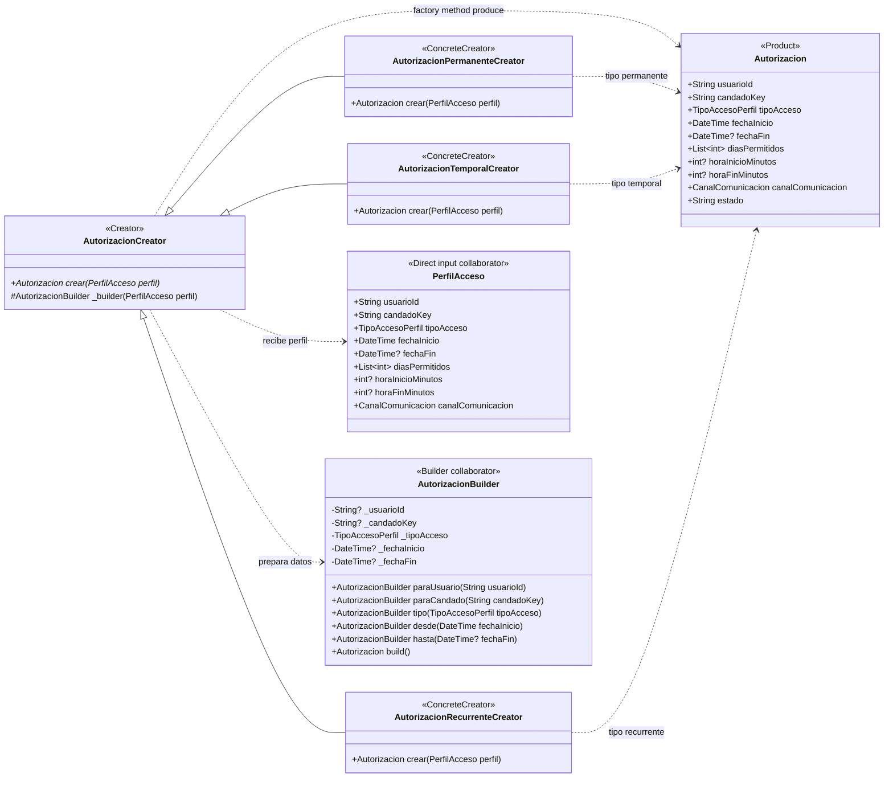

# Factory Method — `AutorizacionCreator`

**Archivo fuente:** `lib/patterns/access/autorizacion_creator.dart`.

## Diagrama de clases

## Funcionamiento en el proyecto

`AutorizacionCreator` es el creador abstracto y declara el método fábrica `crear(PerfilAcceso perfil)`. También centraliza `_builder(perfil)`, que copia los datos del perfil a un `AutorizacionBuilder`.

Las clases concretas especializan la creación: `AutorizacionPermanenteCreator` fuerza el tipo permanente y elimina la fecha final; `AutorizacionTemporalCreator` conserva el tipo temporal y delega en el builder la validación de la fecha final; `AutorizacionRecurrenteCreator` fuerza el tipo recurrente y conserva días y horario. Las tres devuelven el mismo producto abstracto/concreto `Autorizacion`.

En el flujo real, `AutorizacionCreatorFactory.para(perfil.tipoAcceso)` selecciona el creador concreto y luego se llama `crear(perfil)`. Ese selector es un punto de entrada auxiliar existente en el proyecto, pero no se incluye como clase del patrón Factory Method porque no define ni implementa el método fábrica. `AutorizacionBuilder` aparece únicamente como colaborador directo: el método fábrica lo utiliza para construir y validar el producto.

La aplicación usa correctamente Factory Method porque el código cliente puede trabajar con `AutorizacionCreator` sin acoplarse a la clase concreta que corresponde a cada tipo de acceso. Agregar otro tipo requiere un nuevo creador concreto y no modificar la lógica de los creadores existentes.
