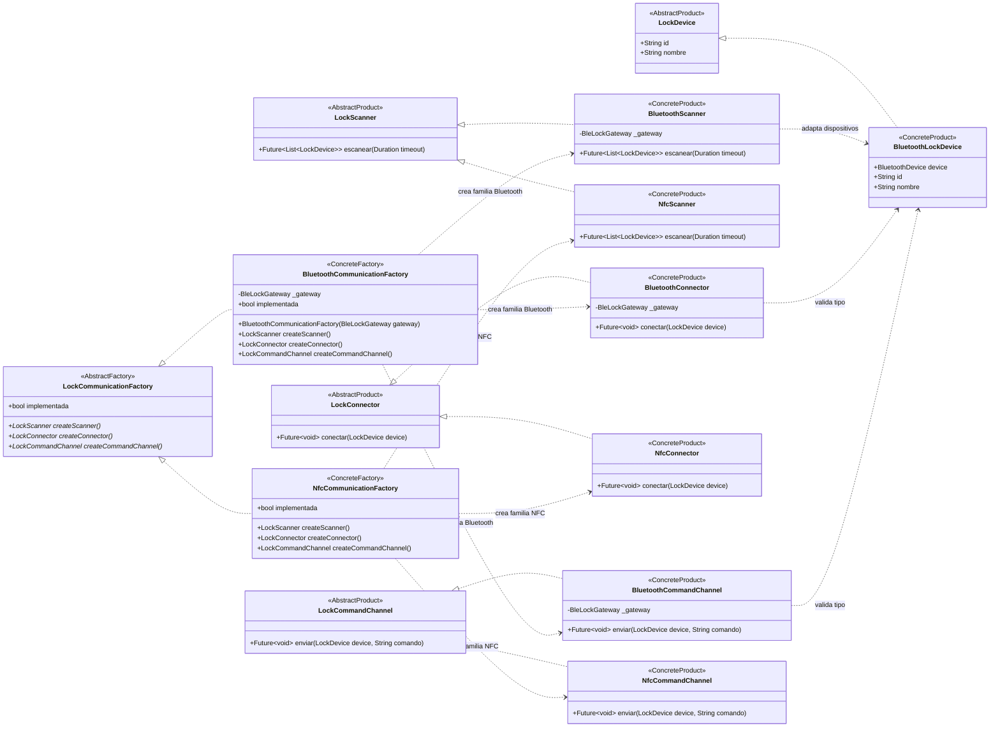

# Abstract Factory — `LockCommunicationFactory`

**Archivo fuente:** `lib/patterns/access/communication_factory.dart`.

## Diagrama de clases

## Funcionamiento en el proyecto

`LockCommunicationFactory` declara la familia de productos relacionados que necesita una comunicación con el candado: scanner, connector y command channel. `BluetoothCommunicationFactory` crea siempre la familia Bluetooth completa; `NfcCommunicationFactory` crea la familia NFC completa.

La coherencia de la familia es la propiedad central del patrón: una instancia de `BluetoothCommunicationFactory` entrega `BluetoothScanner`, `BluetoothConnector` y `BluetoothCommandChannel`, todos compatibles con `BleLockGateway`. Una instancia NFC entrega sus tres productos NFC. La lógica cliente puede depender de las interfaces y no necesita instanciar directamente cada producto concreto.

`LockDevice` y sus implementaciones son el producto de datos utilizado por las tres familias. `BluetoothLockDevice` envuelve el `BluetoothDevice` de Flutter y las clases Bluetooth validan que el dispositivo recibido pertenezca al canal correcto. `BleLockGateway` aparece solo como dependencia técnica directa de la familia Bluetooth; es una abstracción de infraestructura existente en `lib/services/candado/bluetooth_service.dart`, no un producto ni una fábrica del patrón.

NFC está definido arquitectónicamente, pero sus operaciones lanzan `UnsupportedError` porque aún no tiene implementación física en el proyecto. Eso no invalida la estructura del Abstract Factory: la familia y sus productos están definidos, mientras que Bluetooth es la familia operativa actual. `LockCommunicationFactoryProvider` selecciona la fábrica según `CanalComunicacion`, pero se excluye del diagrama por ser un selector auxiliar y no un rol estructural del patrón.
