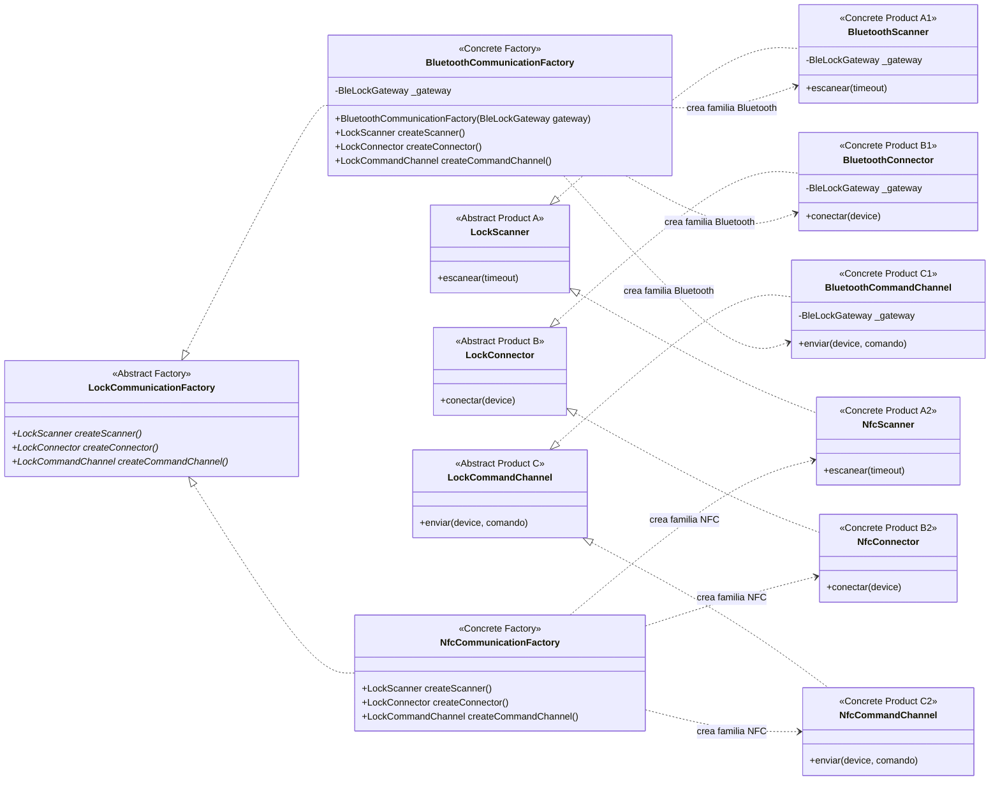

# Abstract Factory — `LockCommunicationFactory`

**Archivo fuente:** `lib/patterns/access/communication_factory.dart`.

## Clases estrictamente pertenecientes al patrón

## Funcionamiento en el proyecto

`LockCommunicationFactory` es la `Abstract Factory` y declara tres métodos de creación para tres familias de productos relacionados: escaneo, conexión y envío de comandos.

`BluetoothCommunicationFactory` es una `Concrete Factory` que crea la familia Bluetooth (`BluetoothScanner`, `BluetoothConnector` y `BluetoothCommandChannel`). `NfcCommunicationFactory` crea la familia NFC (`NfcScanner`, `NfcConnector` y `NfcCommandChannel`). Cada producto concreto implementa la interfaz abstracta de su misma categoría.

La estructura cumple Abstract Factory porque el cliente puede trabajar con `LockCommunicationFactory` y obtener una familia coherente sin instanciar directamente sus productos concretos. Bluetooth es la familia operativa; NFC está definida como extensión arquitectónica y sus operaciones aún lanzan `UnsupportedError`.

`LockDevice` y `BluetoothLockDevice` no aparecen porque son tipos de datos usados por los productos, no productos creados por ninguno de los tres métodos de la fábrica. `BleLockGateway` es una dependencia de infraestructura de los productos Bluetooth y `LockCommunicationFactoryProvider` es un selector auxiliar; ninguno forma parte de los roles estructurales de Abstract Factory.
