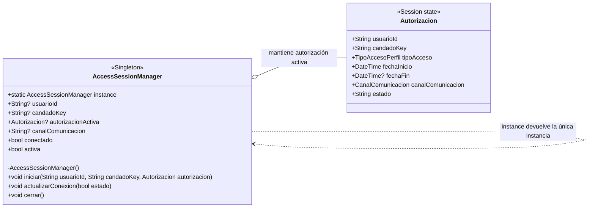

# Singleton — `AccessSessionManager`

**Archivo fuente:** `lib/patterns/access/access_session_manager.dart`.

## Diagrama de clases

## Funcionamiento en el proyecto

`AccessSessionManager` aplica Singleton mediante un constructor privado `AccessSessionManager._()` y una instancia estática única: `static final AccessSessionManager instance = AccessSessionManager._();`. Como el constructor no es accesible desde fuera, el resto de la aplicación obtiene el contexto con `AccessSessionManager.instance`.

La instancia mantiene el único contexto activo de control de acceso: usuario, candado, autorización, canal y estado de conexión. `iniciar()` carga una autorización activa y reinicia el estado de conexión; `actualizarConexion()` cambia el estado BLE; `cerrar()` limpia todos los datos. El getter `activa` indica si existe una autorización vigente en el contexto.

`Autorizacion` se muestra porque es el estado de dominio que el Singleton mantiene directamente; no es otro Singleton ni una instancia global. El test `perfiles_acceso_patterns_test.dart` confirma el contrato con `identical(AccessSessionManager.instance, AccessSessionManager.instance) == true`.

La aplicación usa correctamente Singleton porque el control de una sesión de acceso debe ser compartido por las vistas y servicios que operan sobre el candado, evitando dos contextos activos diferentes en memoria. El alcance está limitado a la sesión viva de la aplicación: no es persistencia de usuario ni reemplaza el almacenamiento de perfiles o autorizaciones.
