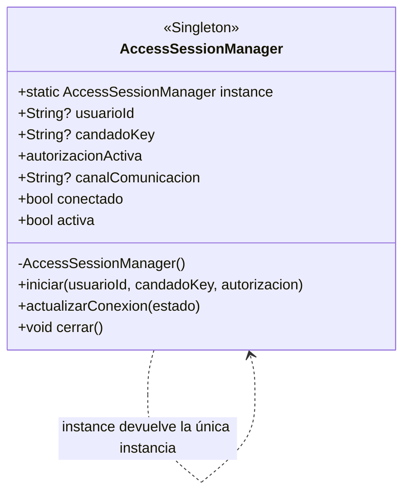

# Singleton — `AccessSessionManager`

**Archivo fuente:** `lib/patterns/access/access_session_manager.dart`.

## Clase estrictamente perteneciente al patrón

## Funcionamiento en el proyecto

`AccessSessionManager` es la única clase que conforma el patrón Singleton. Su constructor `AccessSessionManager._()` es privado y `static final AccessSessionManager instance = AccessSessionManager._()` expone una única instancia compartida durante la ejecución de la aplicación.

La instancia mantiene el contexto activo de control de acceso: usuario, candado, autorización, canal y estado de conexión. `iniciar()` carga el contexto; `actualizarConexion()` cambia el estado de conexión; `cerrar()` limpia la sesión; y `activa` indica si existe una autorización activa. El test del proyecto verifica que dos accesos a `AccessSessionManager.instance` son idénticos.

`Autorizacion` no se incluye en el diagrama porque es un objeto de estado almacenado por el Singleton, no una clase participante de su estructura. Tampoco se incluyen `AutorizacionPermanente`, `AutorizacionTemporal` ni `AutorizacionRecurrente`: son productos de Builder/Factory Method, no Singletons.

La implementación cumple Singleton porque restringe la construcción y centraliza el acceso a una única instancia de `AccessSessionManager`; la relación con la autorización es únicamente una dependencia de datos del estado de sesión.
