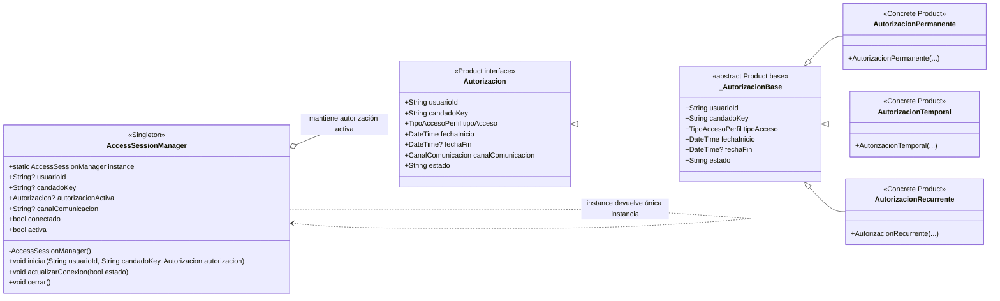

# Singleton — `AccessSessionManager`

**Archivos fuente:** `lib/patterns/access/access_session_manager.dart` y `lib/patterns/access/autorizacion.dart`.

## Diagrama de clases

## Funcionamiento en el proyecto

`AccessSessionManager` conserva el Singleton sin cambios: su constructor `AccessSessionManager._()` es privado y `static final AccessSessionManager instance = AccessSessionManager._()` crea una única instancia accesible por toda la aplicación. El test de patrones comprueba que dos lecturas de `AccessSessionManager.instance` son idénticas.

El cambio nuevo afecta al tipo de estado que administra. `Autorizacion` dejó de ser una clase concreta y pasó a ser una interfaz; `_AutorizacionBase` contiene la implementación común y existen tres productos concretos: `AutorizacionPermanente`, `AutorizacionTemporal` y `AutorizacionRecurrente`. `AccessSessionManager.autorizacionActiva` mantiene la interfaz, por lo que puede recibir cualquiera de esas autorizaciones sin romper el Singleton.

`iniciar()` carga usuario, candado y autorización, copia el canal y reinicia la conexión; `actualizarConexion()` modifica el estado de conexión; `cerrar()` limpia el contexto completo; `activa` indica si hay autorización activa. El Singleton comparte ese contexto entre controladores y servicios que operan sobre el candado.

La aplicación sigue aplicando correctamente Singleton porque existe un único contexto de sesión en memoria. La interfaz `Autorizacion` y sus productos no son Singletons: son objetos de estado creados por Builder/Factory Method y almacenados temporalmente por `AccessSessionManager`. Este alcance evita confundir la unicidad del administrador con la creación de autorizaciones.
